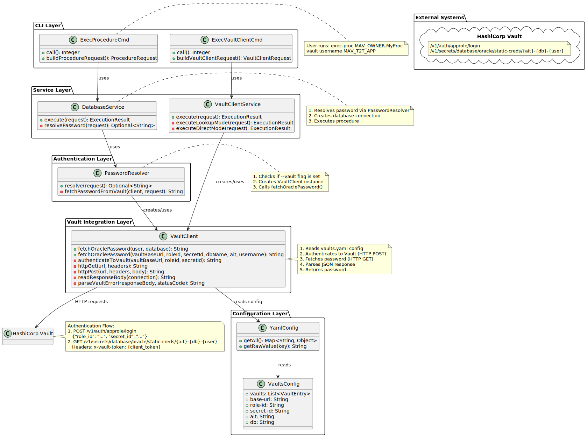

# Design Patterns and Architecture in the AIE Util CLI

## Overview
This document explains the key design patterns, Java theory, and architectural decisions behind the AIE Util CLI application, focusing on how the system enables running Oracle stored procedures from the command line. It is intended for onboarding engineers and as a reference for maintainers.

---

## 1. Inheritance and Class Hierarchy

### Base Command Abstraction
- `BaseDatabaseCliCommand` is an **abstract base class** for all database-related CLI commands.
- Provides common Picocli options (e.g., `--type`, `--database`, `--user`, vault options) and utility methods.

```java
public abstract class BaseDatabaseCliCommand implements Callable<Integer> {
    @Option(names = { "-t", "--type" }, description = "Database type", defaultValue = "oracle")
    protected String type;
    // ... other options ...
    protected final AbstractDatabaseExecutionService service;
    protected BaseDatabaseCliCommand(AbstractDatabaseExecutionService service) {
        this.service = service;
    }
    // ... utility methods ...
}
```

### Concrete Command
- `ExecProcedureCmd` **extends** `BaseDatabaseCliCommand` and implements the Picocli `@Command` pattern.
- It overrides `call()` to build a request and execute the procedure.

```java
@Command(name = "exec-proc", ...)
public class ExecProcedureCmd extends BaseDatabaseCliCommand {
    // ... CLI parameters ...
    @Override
    public Integer call() {
        try {
            final ProcedureRequest request = buildProcedureRequest();
            final ExecutionResult result = service.execute(request);
            result.formatOutput(System.out);
            return result.getExitCode();
        } catch (Exception e) {
            return ExceptionUtils.handleCliException(e, "execute procedure", System.err);
        }
    }
    // ...
}
```

---

## Command Pattern & Picocli Usage

Each CLI command is a class annotated with `@Command` and implements `Callable<Integer>`, encapsulating CLI actions as objects. Example:

```java
@Command(name = "exec-proc", ...)
public class ExecProcedureCmd extends BaseDatabaseCliCommand {
    @Override
    public Integer call() {
        try {
            final ProcedureRequest request = buildProcedureRequest();
            final ExecutionResult result = service.execute(request);
            result.formatOutput(System.out);
            return result.getExitCode();
        } catch (Exception e) {
            return ExceptionUtils.handleCliException(e, "execute procedure", System.err);
        }
    }
}
```

---

## Builder Pattern

Request objects use the builder pattern for safe, fluent, and immutable construction:

```java
ProcedureRequest request = ProcedureRequest.builder()
    .type(type)
    .database(database)
    .user(user)
    .procedure(procedure)
    .input(input)
    .output(output)
    .vaultConfig(createVaultConfig())
    .build();
```

---

## Template Method Pattern

Abstract services use the template method pattern:

```java
public abstract class AbstractDatabaseExecutionService {
    public ExecutionResult execute(final DatabaseRequest request) {
        // ... resolve password ...
        try (Connection conn = createConnection(request, password.get())) {
            return executeWithConnection(request, conn);
        }
    }
    protected abstract ExecutionResult executeWithConnection(DatabaseRequest request, Connection conn) throws SQLException;
}
```

---

## Factory Method Pattern

Static factory methods encapsulate construction logic:

```java
private static DatabaseService createService() {
    return new DatabaseService(
        new PasswordResolver(() -> new String(System.console().readPassword("Enter password: ")))
    );
}
```

---

## Dependency Injection

Manual constructor injection is used for all core services:

```java
public ExecProcedureCmd() {
    super(createService());
}
```

### Dependency Injection Benefits Demonstrated

The recent `VaultClient` refactoring (migration from Apache HttpClient 5.x to `HttpURLConnection`) perfectly demonstrates the benefits of dependency injection and loose coupling:

#### **Zero Breaking Changes**
```java
// PasswordResolver.java - No changes required despite VaultClient refactoring
try (VaultClient client = new VaultClient()) {
    final String password = client.fetchOraclePassword(request.getUser(), request.getDatabase());
    // Method signature unchanged, behavior unchanged
}
```

#### **Interface Stability**
- **Public API unchanged** - All method signatures remain the same
- **Exception handling compatible** - Still throws `IOException` as expected  
- **Resource management compatible** - Still implements `AutoCloseable` correctly
- **Integration points preserved** - All method calls work exactly as before

#### **Loose Coupling Architecture**
```
PasswordResolver → VaultClient → HttpURLConnection
     ↑                ↑              ↑
   Depends on    Abstracts over   Implementation
   Interface      HTTP Details     (Changed)
```

#### **Key Benefits Realized**
1. **Implementation Flexibility** - Can swap HTTP clients without affecting consumers
2. **Testability** - Can mock `VaultClient` for testing `PasswordResolver`
3. **Maintainability** - Changes isolated to single components
4. **Backward Compatibility** - All consuming classes work unchanged

#### **Without Dependency Injection (Hypothetical Bad Design)**
```java
// ❌ Tightly coupled - would require changes throughout codebase
public class PasswordResolver {
    private final CloseableHttpClient httpClient; // Direct dependency on HTTP implementation
    
    public PasswordResolver() {
        // Would need to change this when switching HTTP clients
        this.httpClient = HttpClients.custom()
            .setConnectionManager(poolingManager)
            .build();
    }
}
```

**This demonstrates why dependency injection and loose coupling are architectural best practices - they enable clean, safe refactoring with zero impact on consuming code.**

---

## Strategy Pattern for Connection Strings

Different strategies are used to build JDBC URLs:

```java
public static ConnInfo createConnectionString(String type, String database, String user, String password, String host) {
    ConnectionStrategy strategy;
    if ("h2".equals(type)) { ... }
    else if (host != null) { strategy = new OracleJdbc(host, database); }
    else { strategy = new OracleLdap(database); }
    return new ConnInfo(strategy.buildUrl(), user, password);
}
```

---

## Structured Logging

All errors and important events are logged using structured logging:

```java
LoggingUtils.logStructuredError(
    "procedure_execution",
    "execute",
    "FAILED",
    "Failed to execute procedure with string parameters: " + procFullName,
    e);
```

---

## Centralized Exception Handling

Exception handling is centralized via utility methods:

```java
public static void logAndRethrow(final Exception exception, final String operation) {
    LoggingUtils.logStructuredError("exception", operation, null, exception.getMessage(), exception);
    throw new ConfigurationException("Failed to " + operation + ": " + exception.getMessage(), exception);
}
```

---

## Vault Integration

VaultClient is used to securely fetch secrets at runtime. The implementation uses `HttpURLConnection` for simplicity and reliability, appropriate for the low-frequency, sequential nature of password fetching operations:

```java
public VaultClient() {
    LoggingUtils.logStructuredError(
        VAULT_CLIENT,
        "initialize",
        SUCCESS,
        "VaultClient initialized with HttpURLConnection and 2s timeouts",
        null);
}

private String httpGet(final String url, final Map<String, String> headers) throws IOException {
    final URL urlObj = new URL(url);
    final HttpURLConnection connection = (HttpURLConnection) urlObj.openConnection();
    connection.setRequestMethod("GET");
    connection.setConnectTimeout(CONNECTION_REQUEST_TIMEOUT_MS);
    connection.setReadTimeout(SOCKET_TIMEOUT_MS);

    for (final Map.Entry<String, String> header : headers.entrySet()) {
        connection.setRequestProperty(header.getKey(), header.getValue());
    }

    final int statusCode = connection.getResponseCode();
    // ... handle response and return body
    return readResponseBody(connection);
}

private String readResponseBody(final HttpURLConnection connection) throws IOException {
    final InputStream inputStream = connection.getErrorStream() != null ? 
        connection.getErrorStream() : connection.getInputStream();
    
    try (BufferedReader reader = new BufferedReader(new InputStreamReader(inputStream))) {
        final StringBuilder response = new StringBuilder();
        String line;
        while ((line = reader.readLine()) != null) {
            response.append(line);
        }
        return response.toString();
    }
}
```

**Key Design Decisions:**
- **HttpURLConnection over connection pooling**: Chosen for simplicity and appropriateness to use case
- **Resource management**: Uses try-with-resources for automatic cleanup
- **Error handling**: Structured error parsing with Vault-specific error messages
- **Timeout configuration**: 2-second timeouts for both connection and read operations
- **Stateless design**: No persistent connections, each request creates fresh connection

This approach aligns with the **HTTP Connection Pooling Guidelines** (see section below) for low-frequency, sequential operations typical of CLI tools.

---

## HTTP Connection Pooling Guidelines

### When to Use Connection Pooling

**Use connection pooling when you have:**
- **High-frequency requests** (>100 requests/second)
- **Concurrent operations** (multiple threads making requests simultaneously)
- **Long-lived applications** (running for hours/days continuously)
- **Network-optimized environments** (where connection reuse provides significant benefit)

**Example use cases:**
```java
// ✅ GOOD: High-throughput web service
@RestController
public class ApiController {
    private final CloseableHttpClient client; // Pooled client
    
    public ApiController() {
        PoolingHttpClientConnectionManager cm = new PoolingHttpClientConnectionManager();
        cm.setMaxTotal(200);
        cm.setDefaultMaxPerRoute(20);
        this.client = HttpClients.custom().setConnectionManager(cm).build();
    }
}
```

### When NOT to Use Connection Pooling

**Use HttpURLConnection when you have:**
- **Low-frequency operations** (<10 requests/minute)
- **Sequential execution** (no concurrent requests)
- **Short-lived applications** (CLI tools, batch jobs)
- **Simple resource management** (prefer simplicity over optimization)

**Example use cases:**
```java
// ✅ GOOD: CLI tool for password fetching
public class VaultClient {
    private String httpGet(String url, Map<String, String> headers) throws IOException {
        URL urlObj = new URL(url);
        HttpURLConnection connection = (HttpURLConnection) urlObj.openConnection();
        connection.setRequestMethod("GET");
        connection.setConnectTimeout(2000);
        connection.setReadTimeout(2000);
        // ... use connection and let it auto-close
    }
}
```

### Decision Matrix

| Characteristic | Use Connection Pooling | Use HttpURLConnection |
|----------------|------------------------|----------------------|
| Request Frequency | High (>100/sec) | Low (<10/min) |
| Concurrency | Multiple threads | Single thread |
| Application Lifecycle | Long-running | Short-lived |
| Resource Management | Complex acceptable | Prefer simple |
| Performance Critical | Yes | No |
| Memory Footprint | Higher acceptable | Lower preferred |

### Implementation Patterns

**Connection Pooling Pattern:**
```java
public class PooledHttpClient {
    private final CloseableHttpClient client;
    
    public PooledHttpClient() {
        PoolingHttpClientConnectionManager cm = new PoolingHttpClientConnectionManager();
        cm.setMaxTotal(50);
        cm.setDefaultMaxPerRoute(10);
        
        RequestConfig config = RequestConfig.custom()
            .setConnectionRequestTimeout(5000)
            .setResponseTimeout(10000)
            .build();
            
        this.client = HttpClients.custom()
            .setConnectionManager(cm)
            .setDefaultRequestConfig(config)
            .build();
    }
    
    @Override
    public void close() throws IOException {
        client.close();
    }
}
```

**Simple HttpURLConnection Pattern:**
```java
public class SimpleHttpClient {
    public String get(String url) throws IOException {
        URL urlObj = new URL(url);
        HttpURLConnection connection = (HttpURLConnection) urlObj.openConnection();
        connection.setRequestMethod("GET");
        connection.setConnectTimeout(2000);
        connection.setReadTimeout(2000);
        
        try (BufferedReader reader = new BufferedReader(
                new InputStreamReader(connection.getInputStream()))) {
            // Read response
            return reader.lines().collect(Collectors.joining());
        }
    }
}
```

### Performance Considerations

**Connection Pooling Overhead:**
- **Memory**: Pooled connections consume memory even when idle
- **CPU**: Connection validation and pool management overhead
- **Complexity**: More complex resource lifecycle management
- **Thread Safety**: Requires thread-safe pool implementation

**HttpURLConnection Benefits:**
- **Simplicity**: No pool management complexity
- **Memory Efficient**: No idle connection overhead
- **Reliability**: Automatic cleanup prevents resource leaks
- **Debugging**: Straightforward connection lifecycle

### Best Practices

1. **Start Simple**: Begin with HttpURLConnection unless you have clear evidence of performance bottlenecks
2. **Measure First**: Profile your application to identify actual performance bottlenecks
3. **Consider Context**: Match the solution to your specific use case and requirements
4. **Resource Management**: Always use try-with-resources for proper cleanup
5. **Timeout Configuration**: Set appropriate timeouts regardless of pooling choice

---

## Procedure Parameter Parsing (Immutability, Builder, Utility)

Parsing and validating procedure parameters:

```java
public static ProcedureParam fromString(final String input) {
    final String[] parts = input.split(":");
    if (parts.length != EXPECTED_PARAM_PARTS) {
        LoggingUtils.logStructuredError(
            PARAMETER_PARSING,
            "from_string",
            "INVALID_FORMAT",
            "Invalid parameter format. Expected 'name:type:value', got: " + input,
            null);
        throw new IllegalArgumentException(
            "Invalid parameter format. Expected 'name:type:value', got: " + input);
    }
    return new ProcedureParam(parts[0], parts[1], parts[2]);
}
```

---

## SQL Execution Result Object (Immutability, Factory)

Immutable result objects for SQL execution:

```java
public static SqlResult ofResultSet(
    final List<Map<String, Object>> rows, final ResultSetMetaData metaData) {
  return new SqlResult(rows, metaData, -1, true);
}
```

---

## 8. SPI and Runtime Patterns
- The Oracle JDBC driver is loaded at runtime via the JDBC SPI, not by explicit import.
- This is why the dependency may appear unused to static analysis tools, but is required for runtime operation.

---

## 9. Exception Handling and Utility Patterns
- Centralized exception handling via `ExceptionUtils`.
- Logging via `LoggingUtils`.

---

## 10. End-to-End Example: Running a Stored Procedure

1. **User runs CLI:**
   ```sh
   java -jar aieutil.jar exec-proc MAV_OWNER.MyProc --input "a:INTEGER:1,b:VARCHAR:foo"
   ```
2. **Picocli parses arguments** and instantiates `ExecProcedureCmd`.
3. **`call()` method** is invoked:
   - Builds a `ProcedureRequest` using the builder pattern.
   - Calls `service.execute(request)`.
4. **`DatabaseService.execute()`** (template method):
   - Resolves password (via `PasswordResolver` and possibly `VaultClient`).
   - Creates a JDBC connection (using `ConnectionStringGenerator`).
   - Calls `executeWithConnection()`.
5. **`executeWithConnection()`**:
   - Validates the request.
   - Calls `ProcedureExecutor.executeProcedureWithStrings()` to run the stored procedure.
6. **Results** are wrapped in an `ExecutionResult` and printed to the user.

---

## 11. Deep Dive: Constructor Chaining and Service Injection

### a. Constructor Chaining
- When you instantiate `ExecProcedureCmd`, the following happens:
  1. `ExecProcedureCmd()` is called.
  2. `super(createService())` is invoked.
  3. `createService()` returns a new `DatabaseService`, which is passed to the base class.
  4. `BaseDatabaseCliCommand` stores the service for later use (e.g., in the `call()` method).

### b. Why Pass a Fully Constructed Object?
- **Dependency Injection (DI) Principle:**
  - Makes the class easier to test, more modular, and more maintainable.
- **Single Responsibility Principle:**
  - `ExecProcedureCmd` is responsible for CLI logic, not for knowing how to build a database service.
- **Immutability and Thread Safety:**
  - By passing in a fully constructed, immutable service, you avoid issues with partially constructed objects or race conditions.

### c. What Does “Fully Constructed” Mean?
- All required dependencies are set up and injected.
- The object is ready to use—no further configuration is needed.

### d. What Happens in the Superclass?
- `BaseDatabaseCliCommand` stores the service in a field:
  ```java
  protected final AbstractDatabaseExecutionService service;
  protected BaseDatabaseCliCommand(AbstractDatabaseExecutionService service) {
      this.service = service;
  }
  ```
- All command logic (e.g., in `call()`) can now use `this.service` to perform database operations, without worrying about how it was constructed.

### e. Testability and Extensibility
- In tests, you can pass a mock or stub service:
  ```java
  new ExecProcedureCmd(new MockDatabaseService());
  ```
- In production, you pass the real, fully configured service.

---

## 12. Summary Table of Patterns

| Pattern/Principle         | Where/How Used                                      |
|---------------------------|-----------------------------------------------------|
| Inheritance               | CLI commands, service layer                         |
| Command Pattern           | Picocli commands                                    |
| Builder Pattern           | Request objects                                     |
| Template Method           | Abstract service execution                          |
| Strategy/Factory          | Connection string generation                        |
| Dependency Injection      | Service injected via constructor                    |
| SPI/Runtime Loading       | JDBC driver                                         |
| Exception Handling        | Centralized via ExceptionUtils                      |
| Logging                   | Centralized via LoggingUtils                        |
| HTTP Client Selection     | HttpURLConnection for low-frequency operations      |
| Resource Management       | Try-with-resources for automatic cleanup            |
| Structured Error Parsing  | Vault-specific error message formatting             |

---

## 13. Visual Flow Diagram

```
ExecProcedureCmd()
  |
  |---> createService()
  |         |
  |         |---> new DatabaseService(new PasswordResolver(...))
  |         |         |
  |         |         |---> PasswordResolver uses lambda for password prompt
  |         |         |---> DatabaseService ready to use
  |         |         |
  |         |         |---> returns DatabaseService
  |         |
  |         |---> super(DatabaseService)
            |
            |---> BaseDatabaseCliCommand stores service for use
```

---

## 14. Best Practices and Rationale
- **Constructor injection** and factory methods make the code modular, testable, and maintainable.
- **Separation of concerns** keeps CLI, service, and utility logic distinct.
- **Builder and template method patterns** provide flexibility and extensibility for future features.
- **SPI and runtime loading** allow for pluggable, decoupled drivers and services.

---

*This document is intended as a living reference for the architecture and design patterns in the AIE Util CLI project. For further questions or diagrams, contact the principal engineer or project maintainer.* 

---

## 15. VaultClient Architecture Flow

### VaultClient Integration Points

The `VaultClient` integrates into the application at multiple levels, providing secure password resolution for database connections:



### Key Integration Points

1. **CLI Commands**: Both `ExecProcedureCmd` and `ExecVaultClientCmd` can trigger Vault password resolution
2. **Password Resolution**: `PasswordResolver` creates `VaultClient` instances for secure password fetching
3. **Configuration**: `VaultClient` reads from `vaults.yaml` to determine Vault connection parameters
4. **HTTP Communication**: Uses `HttpURLConnection` for stateless, reliable communication with Vault
5. **Error Handling**: Structured error parsing and logging throughout the flow

### VaultClient Design Principles

- **Stateless**: Each request creates fresh HTTP connections
- **Resource Management**: Uses try-with-resources for automatic cleanup
- **Error Resilience**: Comprehensive error parsing and structured logging
- **Configuration Driven**: Reads Vault parameters from YAML configuration
- **Security Focused**: Implements Vault authentication and secret retrieval patterns

---

## 16. Summary Table of Patterns

| Pattern/Principle         | Where/How Used                                      |
|---------------------------|-----------------------------------------------------|
| Inheritance               | CLI commands, service layer                         |
| Command Pattern           | Picocli commands                                    |
| Builder Pattern           | Request objects                                     |
| Template Method           | Abstract service execution                          |
| Strategy/Factory          | Connection string generation                        |
| Dependency Injection      | Service injected via constructor                    |
| SPI/Runtime Loading       | JDBC driver                                         |
| Exception Handling        | Centralized via ExceptionUtils                      |
| Logging                   | Centralized via LoggingUtils                        |
| HTTP Client Selection     | HttpURLConnection for low-frequency operations      |
| Resource Management       | Try-with-resources for automatic cleanup            |
| Structured Error Parsing  | Vault-specific error message formatting             |

---

## 13. Visual Flow Diagram

```
ExecProcedureCmd()
  |
  |---> createService()
  |         |
  |         |---> new DatabaseService(new PasswordResolver(...))
  |         |         |
  |         |         |---> PasswordResolver uses lambda for password prompt
  |         |         |---> DatabaseService ready to use
  |         |         |
  |         |         |---> returns DatabaseService
  |         |
  |         |---> super(DatabaseService)
            |
            |---> BaseDatabaseCliCommand stores service for use
```

---

## 14. Best Practices and Rationale
- **Constructor injection** and factory methods make the code modular, testable, and maintainable.
- **Separation of concerns** keeps CLI, service, and utility logic distinct.
- **Builder and template method patterns** provide flexibility and extensibility for future features.
- **SPI and runtime loading** allow for pluggable, decoupled drivers and services.

---

*This document is intended as a living reference for the architecture and design patterns in the AIE Util CLI project. For further questions or diagrams, contact the principal engineer or project maintainer.* 